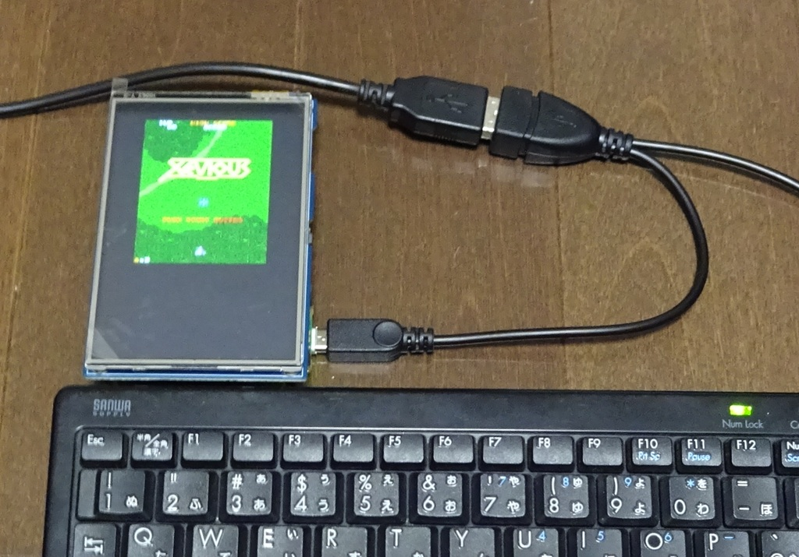
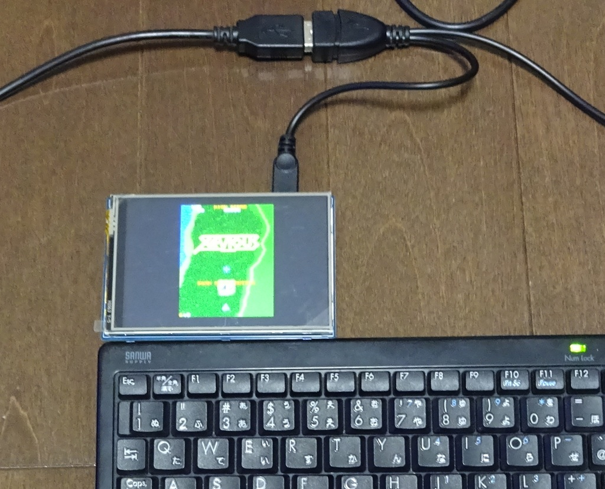

# ResTouch版 Xeviousもどき  
Katsumi様、KenKen様作成の[MachiKania type M](http://www.ze.em-net.ne.jp/~kenken/machikania/typem.html)用に作成した「Xeviousもどき」を  
[ResTouch](https://www.switch-science.com/products/7330)へ移植しました。  

　ResTouch版(VERTICALバージョン）  
  
　ResTouch版(HORIZONTALバージョン）  
  

uf2フォルダー内のファイルを参照ください。  
　　各HORIZONTAL,VERTICALフォルダーにpico版、pico2版に分けて保存しています。  
 　　　※UEBKeyBoadに対応。 キー操作はphyllosoma_Pに準拠、FIREキーはZキー、STARTキーはXキーを追加
